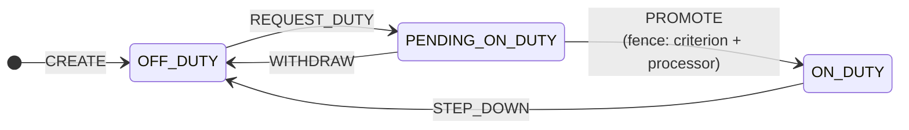
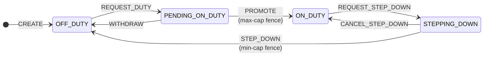
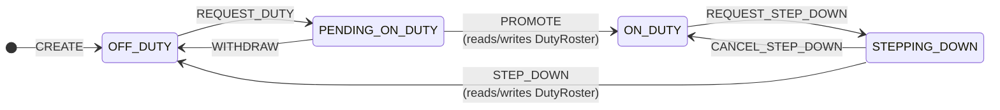

# Cyoda-Go Transactional Consistency

**Version:** 1.0
**Date:** 2026-04-18
**Status:** Canonical reference for cyoda-go's isolation and consistency semantics.

This document is the source of truth for what cyoda-go guarantees, what it
doesn't, and what operational rules apply to workflow authors. ARCHITECTURE.md
§3 (Transaction Model) and PRD.md §4 (Transaction Model) point here for depth.

---

## 1. The contract at a glance

Every cyoda-go storage plugin delivers the same semantic guarantee:

> **Snapshot Isolation with First-Committer-Wins on entity-level conflicts.**

- Reads within a transaction see a consistent snapshot taken at `Begin`.
- Writes within a transaction are visible to its own subsequent reads
  (read-your-own-writes).
- At commit time, if any entity in the transaction's read-set has been
  modified by a concurrent transaction that committed first, the
  transaction aborts with `spi.ErrConflict`. The first transaction to
  commit wins; losers can retry.
- Write-write conflicts on the same entity are caught by the same
  mechanism (and, on the postgres plugin, additionally by row-level tuple
  locks that raise `40001` at DML time before the commit phase even runs).

The guarantee is **entity-granular**: it is expressed in terms of entity
identities, not row identities, predicate ranges, or table partitions.
All four plugins (memory, sqlite, postgres, and the commercial cassandra
plugin) implement this same contract against very different underlying
engines.

Per-segment commit visibility is *not* part of this contract; see §10 for
the `COMMIT_BEFORE_DISPATCH` execution mode, which deliberately splits a
single cascade into multiple transactions and exposes intermediate
segment-boundary states to concurrent readers.

## 2. What this contract catches

All three anomalies classically prevented by Snapshot Isolation:

- **Dirty read.** A transaction never observes another transaction's
  uncommitted writes. Cyoda transactions take a consistent snapshot at
  `Begin` and see only that snapshot plus their own writes.
- **Non-repeatable read.** Re-reading an entity within the same transaction
  always returns the same value. A concurrent committer's update is
  invisible to us until we commit (at which point we either succeed, if our
  read-set is still valid, or abort on conflict).
- **Lost update.** Two transactions reading the same entity, both updating
  it, both committing: exactly one commits, the other aborts. The "last
  committer wins silently" anomaly of READ COMMITTED cannot occur.

Plus the conflict class SI+FCW adds on top of plain SI:

- **Write-write conflicts on the same entity.** Even if both transactions
  read the same initial version and their writes do not depend on each
  other's, only the first to commit succeeds.
- **Write-after-read conflicts on the same entity.** If transaction T1
  reads entity `E` and T2 concurrently writes `E`, T1 cannot commit after
  T2 has committed — T1's read-set validation fails.

## 3. What this contract does NOT catch

**Phantom anomalies from predicate reads.** This is the only anomaly class
that cyoda's SI+FCW does not prevent, and it deserves a precise statement
because workflow authors must understand it.

Consider:

```text
T1: search("status = ACTIVE")           returns [A, B, C]
T1: insert entity X (also ACTIVE)
T1: commit

T2: search("status = ACTIVE")           returns [A, B, C]    (T2 started
                                                              before T1 commit)
T2: insert entity Y (also ACTIVE)
T2: commit
```

Both transactions see `[A, B, C]`, both add one matching entity to the
ACTIVE set, both commit successfully. Neither's read-set included the
other's new entity (how could it? the entity didn't exist at snapshot
time, and a predicate range is not something the read-set can capture
without full predicate locking). No conflict is detected.

In isolation-level terms: cyoda provides **Snapshot Isolation with
First-Committer-Wins on entity-level conflicts** — not full Serializability.
This matches the semantic that Oracle's `SERIALIZABLE` mode (snapshot
isolation with commit-time read-set validation) delivers. It is weaker
than PostgreSQL's native `SERIALIZABLE` (Cahill SSI with
rw-antidependency tracking) on precisely this one anomaly class.

The cyoda postgres plugin deliberately runs at `REPEATABLE READ` and
layers first-committer-wins on top, rather than using PostgreSQL's native
`SERIALIZABLE`. The design rationale is captured in
`docs/superpowers/specs/2026-04-15-postgres-si-first-committer-wins-design.md`
— PostgreSQL's SSI uses b-tree *page* granularity for its dependency
tracking, producing false-positive `40001` aborts on concurrent writes to
disjoint rows that happen to share a page. The FCW implementation gives
entity-row granularity across all plugins and eliminates those false
positives, at the cost of not catching predicate-phantom anomalies. This
is an accepted trade-off captured in cyoda's published semantic contract.

## 3a. Model / Data Contract

Model descriptors are second-class state: they describe the shape of the
first-class data. Because concurrent entity writes coexist with
occasional schema extensions (when a model has a non-empty
`ChangeLevel`), the boundary between the two is part of the
transactional contract itself. The spec living in
`docs/superpowers/specs/2026-04-20-model-schema-extensions-design.md`
states this as five invariants:

1. **Non-interference.** A schema extension triggered inside an
   entity transaction must not cause that transaction (or any
   concurrent entity transaction) to fail with a conflict. In
   practice this means schema extensions don't write the same row
   that entity data writes touch.
2. **Commit-bound visibility.** A schema extension is visible to
   subsequent readers only after the enclosing entity transaction
   commits. Rolled-back entity transactions leave no trace of their
   extension on the observable schema.
3. **Commutativity.** Well-formed deltas fold order-independently.
   Two extensions to the same model produced by concurrent writers
   produce the same folded schema regardless of the interleaving.
4. **Validation-monotonicity.** Every op in the catalog strictly
   broadens the accepted-value set. Documents that validate against
   the base always validate against the extended schema. An op that
   tightens the accepted set (e.g., adding a required field) is
   explicitly excluded from the catalog.
5. **State-machine disjointness.** `Save(desc)` requires the model
   UNLOCKED; `ExtendSchema(ref, delta)` requires the model LOCKED
   with a non-empty `ChangeLevel`. The two paths are disjoint by
   the state machine — they cannot run concurrently against the
   same model.

### Operator Contract for Unlock

`Unlock` is the caller-facing transition from LOCKED to UNLOCKED. The
contract requires writers to **drain before** `Unlock` is invoked —
no `ExtendSchema` may be in flight at the moment `Unlock` runs.

Plugins enforce this defensively: Postgres' `Unlock` and `Save` both
`DELETE` any lingering `model_schema_extensions` rows for the ref.
Under a development-mode flag (`postgres.SetDebugMode(true)`), a
non-zero delete count is treated as a fatal operator-contract
violation and returned as an error. In production the same event
logs a `WARN` and continues — the Save or Unlock itself is the
authoritative schema state at that moment.

Operator misuse — issuing `Unlock` while writers are still in flight
— is undefined behavior at the SPI level (a concurrent writer's
commit is racing with the `Unlock`'s delete). The assertion exists
to catch such misuse loudly in development rather than have it
manifest as silent data loss in production.

## 4. Why the transactional umbrella doesn't fix this by itself

Every transaction in cyoda is started by an entity create/update at the
API surface — `BeginTx` is called in exactly five places, all inside
`internal/domain/entity/service.go` (create, delete, delete-all, batch
create, XML import). All cross-entity CRUD performed by workflow
processors during transition execution happens inside that enclosing
transaction — **except segments crossed by a `COMMIT_BEFORE_DISPATCH`
processor, which split the cascade into multiple transactions**. With
`COMMIT_BEFORE_DISPATCH` the engine commits `TX_pre` before the processor
is dispatched (the entity becomes durable in the pre-callout state and
publicly observable; see §10), and opens `TX_post` on the same node when
the processor returns. CRUD performed by the processor outside any
transaction does not fall under any umbrella; CRUD performed by the
processor in `TX_post` (when `startNewTxOnDispatch=true`) falls under
`TX_post` only, not under `TX_pre`. The umbrella is now per-segment, not
per-cascade, for these workflows.

This "transactional umbrella" bounds *when* a transaction exists and
*what work falls under a single commit point*. But it does not prevent
phantom-driven write-skew, because two concurrent transactions anchored
on *different* entities can still both perform the same predicate search
and both insert matching entities:

```text
T1 (anchored on order #42):
  update order #42
  search("status = ACTIVE AND type = premium")    returns 3 matches
  insert subordinate entity based on that count
  commit

T2 (anchored on order #43):
  update order #43
  search("status = ACTIVE AND type = premium")    returns 3 matches
  insert subordinate entity based on that count
  commit
```

Different anchors, disjoint write-sets on the subordinates, both count
results are "3" at their respective snapshot times, both commit
successfully. Five matching entities now exist although both transactions
thought there would be four.

The umbrella limits the scope of a transaction; it doesn't eliminate the
phantom class.

## 5. Operational rule: don't count inside a transaction

The single canonical rule that workflow authors must observe:

> **Workflow criterion and processor implementations must not perform a
> search within a transactional workflow step and branch on the result
> count or set completeness.**

Code patterns like `search(predicate).count() < threshold` or
`if !search(predicate).any() { ... }` inside a transition criterion or a
processor are susceptible to phantom anomalies. Entity-level reads and
writes (operating on a known entity ID, not a predicate range) are safe.

Additionally: **workflow criteria on transitions following a
`COMMIT_BEFORE_DISPATCH` segment must not depend on cascade atomicity for
the work in earlier segments**. The pre-callout state is publicly visible
between segments (§10), so a criterion that assumes the cascade ran
atomically — e.g. "if A and B have both been advanced as a unit" — can be
falsified by a concurrent reader (or another cascade) acting on the
intermediate state. Express such cross-segment invariants either at the
entity level on the cascade-anchor (FCW catches contention via CAS at
segment continuation) or post-cascade as a reconciliation step.

If your business logic requires a count-based invariant, there are three
robust alternatives:

**(a) Promote the count to a materialised counter entity.** Instead of
searching, read and update a dedicated counter entity by its known ID.
Counter reads land in the read-set; counter writes land in the write-set;
FCW handles contention naturally. Two concurrent transactions racing on
the same counter will serialise via first-committer-wins.

**(b) Encode the invariant as a state-machine precondition.** If the
invariant is "at most N entities of type X can be in state Y at once",
express that as a transition criterion on the individual entity's
state-machine rather than as a global count check. The criterion
evaluates entity-local reads (safe), and the transition commit's FCW
validation handles concurrent contenders.

**(c) Add a post-commit reconciliation step.** If the invariant can be
violated temporarily and a reaper/reconciler pass can detect and correct
it, model that explicitly. This is often the right shape for invariants
that are emergent rather than point-in-time — e.g., "no more than N
active sessions per user" where the correction is to close the oldest.

Workflow authors who follow this rule get effectively-serialisable
behaviour for the transaction classes they write. The isolation level is
still SI+FCW underneath; the rule keeps their workloads inside the
anomaly-free region of it.

## 6. Per-plugin implementation

All plugins honour the same contract. Implementation strategy varies.

| Plugin | Engine-level mechanism | Application-layer validation | Effective guarantee | Conflict granularity |
|---|---|---|---|---|
| **memory** | n/a — all in-process Go | Committed-log + per-transaction read/write-set tracking; first-committer-wins at commit | **SI+FCW** | per-entity |
| **sqlite** | Database-level write lock (single writer at the engine level) | Application-layer SI+FCW; SQLite is the durability layer only | **SI+FCW** | per-entity |
| **postgres** | `REPEATABLE READ` (snapshot) + row-level tuple locks on entity tables | Entity-keyed read-set validation at commit; `40001` (`could not serialize access`) and `40P01` (`deadlock_detected`) mapped to `spi.ErrConflict` with bounded retry | **SI+FCW** | per-entity (via tuple locks on 1-to-1 `entities` table) |
| **cassandra** (commercial) | *(proprietary)* | *(plugin-internal)* | **SI+FCW** | per-entity |

Entity tables on the postgres plugin are keyed by `(tenant_id, entity_id)`
for `entities` and by `(tenant_id, entity_id, version)` for
`entity_versions`. Because `entities` is 1-to-1 with logical entities,
PostgreSQL's tuple-level row lock on an `entities` row is semantically
equivalent to an entity-level lock.

The application-layer read-set in `plugins/postgres/txstate.go` is keyed
by entity ID (`readSet map[string]int64`, value = version observed).
Validation at commit compares each entity's expected version to the
latest committed version via a batched `SELECT ... FOR SHARE` over the
read-set rows. Mismatches raise `spi.ErrConflict`; PostgreSQL's own
`40001` on the `FOR SHARE` is a second, redundant guard for the same
condition. Write-write conflicts are caught earlier, at the DML statement
that tries to `UPDATE`/`INSERT` the entity row, by PostgreSQL's implicit
tuple-exclusive lock.

## 7. Worked scenarios

### 7.1 Concurrent updates to the same entity — FCW serialises them

```text
Initial: entity E version 1.

T1: read E @ v1, update E (write-set captures pre-write version 1)
T2: read E @ v1, update E (write-set captures pre-write version 1)

T1 commits first.
- Memory/sqlite: writes E@v2 to committedLog, prunes older versions.
- Postgres: DML UPDATE takes tuple-exclusive lock; commits E@v2.

T2 tries to commit.
- Memory/sqlite: read-set validation finds E moved from v1 to v2 →
  ErrConflict.
- Postgres: either (a) T2's UPDATE raised 40001 at DML time because T1's
  commit had already landed, or (b) commit-phase `FOR SHARE` raises 40001
  on the stale snapshot. Either way, ErrConflict.

Result: T1 succeeds, T2 aborts. T2 retries with a fresh snapshot.
```

Safe. All plugins handle this identically from the caller's perspective.

### 7.2 Read one entity, write another — FCW catches cross-entity conflict

```text
Initial: entity A v1, entity B v1.

T1: read A @ v1 (captures A:v1 in read-set),
    update B based on A's data (captures B's pre-write version in write-set)
T2: update A (captures A's pre-write version in write-set)

T2 commits first → A@v2.

T1 tries to commit.
- Read-set validation: A was read at v1, latest committed is v2 → ErrConflict.

Result: T1 aborts. T1 retries, observes A@v2, recomputes B's update
based on the new A data.
```

Safe. The cross-entity dependency `B depends on A` is captured in T1's
read-set explicitly (T1 read A), so FCW validates it at commit.

### 7.3 Predicate-based count — NOT safe (the phantom case)

```text
Initial: 3 entities matching "status = ACTIVE".

T1: search("status = ACTIVE") → [A, B, C]; "3 < 5, ok to add another"
    insert X with status = ACTIVE
T2: search("status = ACTIVE") → [A, B, C]; "3 < 5, ok to add another"
    insert Y with status = ACTIVE

Neither transaction's read-set contains the other's new entity (X and Y
didn't exist at snapshot time). The commit validation cannot detect
anything wrong.

T1 commits. T2 commits. Now there are 5 ACTIVE entities, though each
transaction believed there would be 4.
```

**This is the anomaly class the operational rule in §5 exists to prevent.**
The workaround is any of §5 (a), (b), or (c) — most commonly, promote
the count to a counter entity the workflow can read/write by ID.

### 7.4 Workflow-encoded invariant — safe by design

State-machine transitions naturally funnel the "should I do X?" decision
through entity-local criteria that evaluate against the anchor entity's
own state. A transition's criterion is evaluated within the transaction
that performs the transition, and the criterion's reads enter the
transaction's read-set.

Consider an Order entity whose "SHIP" transition has the criterion
`order.approvals_received >= 2`. If two concurrent transactions both try
to fire SHIP on the same order:

- Both read `order.approvals_received` = 2 and the criterion passes.
- Both capture `order@current-version` in their read-set.
- Both attempt to write the new state.
- First committer wins via FCW on the `order` entity. Second aborts with
  `ErrConflict` and retries; on retry, the order may already be in state
  SHIPPED and the transition no longer applicable.

Because the invariant is expressed as a criterion on the entity being
transitioned, FCW on that entity is the guard. No phantom can slip past.

## 8. Multi-node routing preserves the contract

cyoda-go runs as a cluster (3–10 stateless nodes behind a load balancer
for the postgres plugin; other plugins have their own topologies). The
per-node `TransactionManager` holds per-transaction state (read-set,
write-set, postgres `pgx.Tx` handle) in the process memory of the node
that called `Begin`. Subsequent requests inside the same transaction
must route back to that node — enforced by the cluster-mode dispatch
layer (HMAC-signed transaction tokens + AEAD-encrypted inter-node
forwarding via the `PeerAuth` seam).

The isolation contract is therefore preserved end-to-end: an API caller
interacting with transaction `T` always lands on the same node for the
duration of `T`; the `Commit` that finally applies FCW validation
executes on the node that owns `T`. Cluster membership changes (node
failure, scale-out) may cause in-flight transactions on the affected
node to abort, but they cannot cause a committed transaction to be
observed out of order or a concurrent transaction to slip past FCW
validation.

The memory and sqlite plugins are single-process: multi-node deployment
is not supported (memory has no shared store; sqlite holds an exclusive
file lock for the process lifetime). The postgres plugin is designed for
multi-node; the commercial cassandra plugin is designed for
multi-cluster.

## 9. Isolation-level taxonomy for orientation

For readers familiar with the standard isolation-level vocabulary:

| Anomaly | READ COMMITTED | REPEATABLE READ (SI) | cyoda SI+FCW | Cahill SSI / PostgreSQL `SERIALIZABLE` |
|---|---|---|---|---|
| Dirty read | prevented | prevented | prevented | prevented |
| Non-repeatable read | not prevented | prevented | prevented | prevented |
| Phantom read | not prevented | partially prevented | partially prevented | prevented |
| Lost update | not prevented | depends on engine | prevented | prevented |
| Write-skew | not prevented | not prevented | not prevented for predicate reads; prevented for entity-level reads | prevented |

**cyoda-go SI+FCW sits between plain SI and full Serializability.** It
catches all the anomalies SI catches plus lost-update plus entity-level
write-skew. The one remaining class is predicate-based write-skew, which
the operational rule in §5 keeps workloads out of.

PostgreSQL's native `SERIALIZABLE` catches predicate-based write-skew
too, but at the cost of b-tree-page-granular dependency tracking that
produces false-positive `40001` aborts on concurrent writes to disjoint
rows that happen to share a page. Cyoda explicitly chose to not use that
mode — see the postgres-si-first-committer-wins design spec for the
trade-off analysis.

## 10. Practical guidance for workflow authors

A short checklist:

1. **Express invariants as transition criteria on the entity being
   transitioned.** Those criteria's reads are captured in the read-set;
   FCW guards them.
2. **If you need a count, keep the counter as an entity.** A "counters"
   entity with well-known IDs you read/write by name is indistinguishable
   from any other entity to the isolation layer — fully FCW-protected.
3. **Never branch on `search(predicate).count()` inside a transactional
   workflow step.** If you catch yourself writing this, step back and
   apply (a) or (b) from §5.
4. **Expect `spi.ErrConflict`; don't wrap it as an internal error.**
   Conflicts are a normal signal that a concurrent transaction beat yours
   to the commit. The retry loop lives at the API boundary (the HTTP
   handler and gRPC service translate `ErrConflict` to `409 Conflict`
   with `retryable: true`); internal code should let it bubble.
5. **Keep transactions short.** Long-running transactions hold a larger
   read-set, widening the window in which a concurrent committer can
   invalidate it. If a workflow step needs to do slow work (e.g. an
   external HTTP call), use `COMMIT_BEFORE_DISPATCH` on that processor
   so the engine commits the pre-callout entity state, runs the slow
   work outside any transaction, and opens a fresh `TX_post` only for
   the apply-result work. This collapses connection-hold time from
   "full processor wall-clock" to "segment-boundary work" (typically
   tens to low-hundreds of milliseconds), at the cost of breaking
   cascade atomicity at the segment boundary (see bullets 7–9 below).
   `ASYNC_NEW_TX` (savepoint mode) does **not** relieve connection-pool
   pressure; it only changes failure semantics.
6. **Don't assume Serializable-class isolation.** If your use case truly
   needs phantom protection (e.g. compliance-driven "no more than N
   entities in state X per tenant, ever"), either materialise the count
   or add a reconciliation step.
7. **`COMMIT_BEFORE_DISPATCH` makes segment-boundary states publicly
   visible.** A concurrent reader's `Get`/`GetAll`/`Search`/`Count`
   between `TX_pre.Commit` and `TX_post.Commit` will see the entity in
   the pre-callout state. A second cascade may decide to fire
   criteria-driven transitions on that intermediate state. Treat
   segment-boundary states as committed; design state-machine criteria,
   transition guards, and external monitoring accordingly. If
   invisibility is required, model a `DRAFT` parent state with
   sub-stages in payload, or do not expose the entity until a designated
   terminal state.
8. **`COMMIT_BEFORE_DISPATCH` requires processor idempotency.** Replays
   can fire from CAS conflict during continuation (the caller's retry
   restarts the cascade and re-dispatches the processor) or from an
   engine crash between segments (the entity is durable in the
   pre-callout state, the in-flight orchestration is gone, the caller
   retries, the cascade re-fires from the beginning). The engine
   cannot deduplicate replays — workflow authors must implement
   idempotency on application-meaningful keys (a write-once external
   resource ID, a deterministic external resource name derived from
   entity ID, etc.). This is asymmetric to client-driven manual
   loopback: a client knows it crashed and owns the retry decision; an
   engine crash mid-cascade leaves the **server** silently holding a
   partially-progressed entity.
9. **No double-writing the cascade-anchor entity.** A processor with
   TX-callback access (SYNC, ASYNC_SAME_TX, COMMIT_BEFORE_DISPATCH with
   `startNewTxOnDispatch=true`) must not save the entity it is
   processing for via the supplied transaction token **and** also
   return mutations for that same entity in its result. The engine's
   apply-result will overwrite the processor's intra-TX writes
   (last-writer-wins inside the transaction buffer). Pick one path:
   let the engine apply the result, OR have the processor write the
   entity itself and return no mutations for it. Cross-link:
   `cmd/cyoda/help/content/workflows.md` carries this best-practice
   verbatim.
10. **Batch operations degrade under `COMMIT_BEFORE_DISPATCH`.** Under
    `UpdateEntityCollection` (or any all-or-nothing batch) where at
    least one item triggers a cascade segmented by
    `COMMIT_BEFORE_DISPATCH`, the all-or-nothing batch semantic
    degrades. Earlier items' `TX_pre` segments commit durably before
    later items run; a later item's failure cannot unroll those
    earlier durable segments. Workflow authors using batch APIs with
    `COMMIT_BEFORE_DISPATCH` processors must either (a) tolerate
    partial-success batches and design idempotent re-submission, or
    (b) avoid `COMMIT_BEFORE_DISPATCH` on workflows reachable from
    batch endpoints.

## 11. References

- `docs/ARCHITECTURE.md` §3 — Transaction Model overview.
- `docs/PRD.md` §4 — Transaction Model at the product level.
- `docs/plugins/IN_MEMORY.md`, `SQLITE.md`, `POSTGRES.md` — per-plugin
  implementation specifics.
- `docs/superpowers/specs/2026-04-15-postgres-si-first-committer-wins-design.md`
  — rationale for postgres plugin running at `REPEATABLE READ` instead
  of native `SERIALIZABLE`.
- `docs/superpowers/specs/2026-04-15-sqlite-storage-plugin-design.md` —
  rationale for porting the memory plugin's SI+FCW engine into sqlite.

The commercial Cassandra plugin's own design document (shipped with the
proprietary binary) captures the same semantic contract with the same
§5 operational rule, verbatim.

---

## Appendix A: Worked example — the Doctor On-Call Roster

The Doctor On-Call Roster is the classic write-skew teaching example. It
is instructive for cyoda because it shows, concretely, how the
state-machine discipline turns a predicate anti-dependency (which SI+FCW
does not catch) into an entity-level read/write conflict (which it does).

### A.1 The invariant and the naive failure

A hospital has an on-call roster. The invariant for this appendix:

> **At most `N` doctors may be ON_DUTY at any one time.**

(The symmetric "at least one must be ON_DUTY" works the same way;
A.6 addresses it briefly.)

Naive model: a `Doctor` entity with two states, `OFF_DUTY` and `ON_DUTY`.
The promotion transition `OFF_DUTY → ON_DUTY` carries a criterion that
counts current ON_DUTY doctors and rejects if the cap would be exceeded.

```text
transition PROMOTE:
  from:      OFF_DUTY
  to:        ON_DUTY
  criterion: Count(Doctor where state = ON_DUTY) < N
```

Two concurrent transactions, each promoting a different doctor, both
start before either commits:

```text
Initial: Alice, Bob ON_DUTY (count = 2). Cap N = 3. Carol, Dave OFF_DUTY.

T1: promote Carol to ON_DUTY
    Count(ON_DUTY) = 2 at snapshot → 2 < 3 → criterion passes
    write Carol @ state = ON_DUTY

T2: promote Dave to ON_DUTY
    Count(ON_DUTY) = 2 at snapshot → 2 < 3 → criterion passes
    write Dave @ state = ON_DUTY

T1 commits. T2 commits. Final: 4 ON_DUTY. Invariant violated.
```

This is the phantom case from §7.3, expressed at the workflow level.

### A.2 Why SI+FCW does not catch it out of the box

Under cyoda's contract (§1), FCW triggers when a transaction's read-set
intersects a concurrent committer's write-set. In the naive design:

- T1's read-set contains `{Alice, Bob}` (the ON_DUTY doctors Count
  would surface) — but the postgres plugin's `Count` does not populate
  the read-set at all: it is an aggregate with no per-row identity, and
  `plugins/postgres/entity_store.go:376` documents that exclusion
  explicitly.
- T1's write-set contains `{Carol}`.
- T2's read-set (if populated) would be the same `{Alice, Bob}`; its
  write-set is `{Dave}`.

Read-sets and write-sets are entity-identity-disjoint across T1 and T2.
Nothing for FCW to latch onto. Both commit. The predicate "how many
ON_DUTY doctors exist" is not an entity — it is a count over a range —
and the snapshot neither of T1 nor of T2 saw the other's addition
because the addition didn't exist at their respective `Begin`.

### A.3 The workflow fence: `PENDING_ON_DUTY`

Introduce a third state, `PENDING_ON_DUTY`, and make the workflow
enforce two invariants:

1. **All admissions go through `PENDING_ON_DUTY` first.** A `Doctor`
   entity can only enter `ON_DUTY` from `PENDING_ON_DUTY`, never
   directly from `OFF_DUTY` or from creation. Enforced by the FSM: no
   transition `OFF_DUTY → ON_DUTY` exists; there is only
   `OFF_DUTY → PENDING_ON_DUTY` and `PENDING_ON_DUTY → ON_DUTY`.
2. **The promotion processor reads every peer candidate by entity, not
   by aggregate.** The `PENDING_ON_DUTY → ON_DUTY` transition's
   processor calls `entityStore.GetAll(Doctor)` (or an equivalent that
   returns individual entities) and filters in-memory for states
   `ON_DUTY` and `PENDING_ON_DUTY`. It does **not** call
   `Count`/`CountByState`.

#### A.3.1 State diagram

There is **no** transition into `ON_DUTY` except `PROMOTE` from
`PENDING_ON_DUTY`. Creation lands in `OFF_DUTY` only. This is the whole
point of the fence: the FSM itself forbids the write-skew-enabling
direct path.



ASCII equivalent for terminal readers:

```text
                 CREATE
                   │
                   ▼
              ┌─────────┐   REQUEST_DUTY   ┌──────────────────┐
              │ OFF_DUTY │ ───────────────▶ │ PENDING_ON_DUTY  │
              │         │ ◀─────────────── │                  │
              └─────────┘    WITHDRAW      └──────────────────┘
                   ▲                                │
                   │                        PROMOTE │ ← fence here
                   │ STEP_DOWN                      │   (criterion + processor
                   │                                │    read all Doctors)
                   │                                ▼
                   └──────────────────────── ┌──────────┐
                                             │ ON_DUTY  │
                                             └──────────┘

Forbidden paths (enforced by the FSM — no such transitions exist):
  × CREATE → ON_DUTY          (no direct admit)
  × OFF_DUTY → ON_DUTY        (must go through PENDING_ON_DUTY)
  × any path bypassing PROMOTE's criterion/processor
```

#### A.3.2 Transition table

| Transition    | From              | To                | Criterion        | Processor    |
|---------------|-------------------|-------------------|------------------|--------------|
| `CREATE`      | `[*]`             | `OFF_DUTY`        | —                | —            |
| `REQUEST_DUTY`| `OFF_DUTY`        | `PENDING_ON_DUTY` | —                | —            |
| `WITHDRAW`    | `PENDING_ON_DUTY` | `OFF_DUTY`        | —                | —            |
| `PROMOTE`     | `PENDING_ON_DUTY` | `ON_DUTY`         | `promote_ok`     | `promote`    |
| `STEP_DOWN`   | `ON_DUTY`         | `OFF_DUTY`        | `step_down_ok`   | —            |

#### A.3.3 Criterion and processor pseudocode

The two invariant-bearing callbacks live on `PROMOTE`. Both do an
**entity-level** read of all peers — `GetAll` on the postgres plugin
walks the entities table and calls `recordReadIfInTx` for every row
(`plugins/postgres/entity_store.go:232-236`), so every peer's version
enters the transaction's read-set.

```text
criterion promote_ok(self):
    all := entityStore.GetAll(model = Doctor)   // populates read-set
    onDuty := [ d for d in all if d.state == ON_DUTY ]
    return len(onDuty) < N

processor promote(self):
    all := entityStore.GetAll(model = Doctor)   // populates read-set
    onDuty  := [ d for d in all if d.state == ON_DUTY ]
    pending := [ d for d in all if d.state == PENDING_ON_DUTY ]
    if len(onDuty) >= N:
        return error("cap reached")
    // Optional deterministic-winner rule (reduces useless retries
    // under contention; not required for the fence):
    //   if self.id != min(d.id for d in pending):
    //       return error("yield to earlier PENDING candidate")
    self.state = ON_DUTY
```

Non-negotiables for the author:

- Use `GetAll` (or an equivalent predicate scan that returns entities).
  **Never** use `Count` / `CountByState` here — aggregates do not
  populate the read-set and silently disable the fence.
- Read then filter. Filter-then-read via a non-transactional pre-fetch
  shrinks the read-set and lets peers slip past.
- The criterion's `GetAll` and the processor's `GetAll` hit the same
  read-set (first-read-wins — `plugins/postgres/txstate.go:58-70`). The
  redundancy is harmless; collapse to one if preferred.

### A.4 Why this is a fence — step by step

Now replay the scenario. Carol and Dave start in `PENDING_ON_DUTY`, not
`OFF_DUTY`.

```text
Initial: Alice, Bob ON_DUTY. Carol, Dave PENDING_ON_DUTY. Cap N = 3.

T1: PROMOTE Carol
    GetAll → {Alice@v, Bob@v, Carol@v, Dave@v} all enter read-set
    onDuty = {Alice, Bob}; pending = {Carol, Dave}
    len(onDuty)=2 < 3 → criterion passes
    write Carol @ state=ON_DUTY  (Carol promoted from read-set to write-set)
    T1 commit snapshot: read-set = {Alice, Bob, Dave}, write-set = {Carol}

T2: PROMOTE Dave
    GetAll → {Alice@v, Bob@v, Carol@v, Dave@v} all enter read-set
    onDuty = {Alice, Bob}; pending = {Carol, Dave}
    len(onDuty)=2 < 3 → criterion passes
    write Dave @ state=ON_DUTY
    T2 commit snapshot: read-set = {Alice, Bob, Carol}, write-set = {Dave}
```

Compare read-sets to concurrent write-sets:

- `T1.readSet ∩ T2.writeSet = {Alice,Bob,Dave} ∩ {Dave} = {Dave}` — non-empty.
- `T2.readSet ∩ T1.writeSet = {Alice,Bob,Carol} ∩ {Carol} = {Carol}` — non-empty.

Whichever commits first wins; the other's `ValidateReadSet` finds the
peer it observed has been modified and returns `spi.ErrConflict`. FCW
has transformed what was a predicate-level anti-dependency into a
concrete entity-level read/write conflict it can see.

The mechanism is exactly what `plugins/postgres/txstate.go:116-129`
describes: at commit, every entity in the read-set is checked against
its latest committed version; any mismatch aborts.

### A.5 What the two invariants are buying

Each invariant plugs a specific leak.

**Invariant 1 (all admissions through `PENDING_ON_DUTY`)** exists
because a blind direct insert in `ON_DUTY` — `create Doctor with
state=ON_DUTY` — is a *new* entity. It does not exist at any concurrent
transaction's snapshot, so it cannot enter their read-sets. Two
concurrent blind inserts, each reading `Count(ON_DUTY) < N`, both
commit. The `PENDING_ON_DUTY` pre-registration makes every candidate a
discoverable entity in the transaction system *before* its promotion
becomes visible, so concurrent promotion transactions see each other's
candidates as peers in their read-sets.

**Invariant 2 (entity-level read, not aggregate)** exists because `Count`
and `CountByState` do not populate the read-set. An author who writes
`if CountByState(Doctor, [ON_DUTY]).sum() < N` inside a criterion gets
the exact naive-failure mode from A.1 even with `PENDING_ON_DUTY` in
the model. `GetAll`-and-filter preserves the per-entity identity that
FCW needs.

### A.6 The symmetric case: minimum-cap

The invariant "at least `M` doctors must be `ON_DUTY`" uses the same
structure in reverse. Introduce a `STEPPING_DOWN` state. `ON_DUTY`
exits only through `STEPPING_DOWN`; `STEPPING_DOWN → OFF_DUTY` carries
the fence criterion/processor.



ASCII equivalent:

```text
 CREATE
   │
   ▼
┌─────────┐ REQUEST_DUTY ┌──────────────┐  PROMOTE   ┌──────────┐
│OFF_DUTY │─────────────▶│PENDING_ON_DTY│───────────▶│ ON_DUTY  │
│         │◀─────────────│              │            │          │
└─────────┘   WITHDRAW   └──────────────┘            └──────────┘
   ▲                                                       │
   │                                                       │ REQUEST_STEP_DOWN
   │ STEP_DOWN (min-cap fence)                             ▼
   │                                                 ┌──────────────┐
   └──────────────────────────────────────────────── │STEPPING_DOWN │
                                                     │              │
                                                     └──────────────┘
                                                           ▲
                                                           │ CANCEL_STEP_DOWN
                                                           │ (back to ON_DUTY)

Forbidden paths (enforced by the FSM):
  × ON_DUTY → OFF_DUTY direct        (must pass STEPPING_DOWN)
  × STEPPING_DOWN → OFF_DUTY without criterion   (no such transition)
```

Criterion and processor pseudocode:

```text
criterion step_down_ok(self):
    all := entityStore.GetAll(model = Doctor)   // populates read-set
    // Peer count of doctors who will still be ON_DUTY or
    // STEPPING_DOWN after this transition. Self is excluded since
    // we're leaving the set.
    remaining := [
        d for d in all
        if d.id != self.id and d.state in (ON_DUTY, STEPPING_DOWN)
    ]
    return len(remaining) >= M
```

Two doctors concurrently invoking `STEP_DOWN`:

- Each `GetAll` captures the other in the read-set (both were `ON_DUTY`
  or `STEPPING_DOWN` at the respective snapshots).
- Each writes its own entity (own state → `OFF_DUTY`).
- First committer wins. Second's `ValidateReadSet` observes peer has
  moved and returns `spi.ErrConflict`. The retry re-reads the now-
  depleted set and the criterion correctly rejects dropping below `M`.

The `STEPPING_DOWN` intermediate state mirrors `PENDING_ON_DUTY`: it
serialises the conflict through a read-before-write point where peer
entities are observable.

### A.7 Residual phantoms the fence does NOT close

The fence is only as strong as invariants 1 and 2. Specific residuals:

- **Creation that bypasses `PENDING_ON_DUTY`.** If the API surface
  allows a doctor to be created directly with `state=ON_DUTY` (whether
  via admin tooling, import, or a badly modelled FSM), the pre-existing
  promotion transactions cannot see that new entity until it commits,
  and the fence is bypassed. The FSM must prohibit this transition;
  import and administrative paths must too.
- **Workflow author calls `CountByState` instead of `GetAll`.** Silent
  bypass — the criterion passes, no read-set is populated. Enforceable
  by code review and the §5 operational rule.
- **Criterion reads a subset of candidates.** If the processor filters
  the `GetAll` results before recording reads (e.g., by using a
  non-transactional pre-fetch), the read-set shrinks and peers outside
  the filter fall through. Always read then filter; never filter then
  read.

### A.8 On the "workflow fence" framing

The draft article's framing — that a well-modelled workflow "fences"
against write-skew without needing Cahill SSI — is correct **for
cyoda's isolation model** provided the two invariants in A.3 hold. The
mechanics:

- Workflows materialise peer candidates as identifiable entities
  (invariant 1).
- Workflow processors read those peers by entity, not by aggregate
  (invariant 2).
- Entity-level reads populate the read-set; FCW at commit enforces
  entity-level conflicts.
- The result is the same serialisable outcome Cahill SSI would give,
  but obtained through application-layer structure rather than
  b-tree-page-granular engine-level dependency tracking.

This is not a universal claim about workflows and databases — it is a
specific claim about what cyoda's SI+FCW contract delivers when the
workflow author observes §5 and follows the pattern in this appendix.
Workloads that cannot be modelled this way (ad-hoc predicate analytics
over uncoordinated entity sets, for instance) should use one of the
alternatives in §5.

The pattern generalises. Any invariant of the form "at most N entities
of type X in state Y" or "at least M entities of type X in state Y"
admits an analogous fence: introduce a pending/stepping intermediate
state for the rate-limited transition, and read all peer entities in
the processor. The cap check then runs against a materialised peer set
inside the transaction, and FCW converts concurrent violations into
retryable conflicts.

### A.9 Interaction with `COMMIT_BEFORE_DISPATCH`

The on-duty cap relies on cascade atomicity for the PROMOTE pipeline:
the criterion `Count(Doctor where state = ON_DUTY) < N` runs in the
same transaction that performs the `PENDING_ON_DUTY → ON_DUTY` write,
so FCW catches contention via the materialised peer read-set (A.3,
A.4). **`COMMIT_BEFORE_DISPATCH` placed on a processor in the PROMOTE
pipeline breaks this fence.**

Concretely: if any processor on the `PENDING_ON_DUTY → ON_DUTY`
transition (or on the staging transition `OFF_DUTY → PENDING_ON_DUTY`,
if the cap is checked there) is configured `COMMIT_BEFORE_DISPATCH`,
the engine commits the pre-callout state — including any peer reads in
that segment — before the processor runs, and opens `TX_post` for the
apply-result. Two failure modes follow:

1. **The peer read-set is split across two transactions.** The
   criterion's peer reads land in `TX_pre`; the apply-result lands in
   `TX_post`. `TX_post`'s read-set is *not* the union of both
   segments' read-sets (each transaction validates its own read-set
   independently at commit). A concurrent promotion that commits
   between `TX_pre` and `TX_post` invalidates the cap check the
   criterion ran against, but `TX_post` does not see the conflict
   because the peer set was never read inside `TX_post`. The fence is
   bypassed.
2. **The pre-callout state is publicly observable.** Between
   `TX_pre.Commit` and `TX_post.Commit`, the doctor is durably in
   `PENDING_ON_DUTY` — a concurrent promotion's criterion sees that
   doctor in its peer set, but that's the only safety net, and it's
   only as strong as the criterion's read-set semantics, not the
   pipeline-internal cap check.

**Rule:** transitions that enforce a population-level invariant
(at-most-N, at-least-M) via materialised peer reads **must not**
carry a `COMMIT_BEFORE_DISPATCH` processor on either the staging
transition or the commit transition of the fence. If slow external
work is required on such a transition (e.g. a notification call), use
`SYNC` and accept the connection-hold cost, or restructure the
workflow so the slow work runs on a separate transition that does not
participate in the fence (e.g. on a post-`ON_DUTY` notification
transition where atomicity with the cap check is not required).

The same rule applies to the symmetric minimum-cap fence (A.6) and to
the multi-entity fence pattern in Appendix B: the materialised
read-set and the apply-result must be in the same transaction.
`COMMIT_BEFORE_DISPATCH` is incompatible with that requirement.

---

## Appendix B: Scaling the fence — `Doctor` + `DutyRoster`

Doctors on call is a teaching example. The class of invariants it
represents — "at most N members of a set may be in state Y, at any
time" — is pervasive in production workloads, and in most of them the
member population is orders of magnitude larger than a hospital
roster:

- **Payments.** "A customer may have at most K pending authorisations
  against an account." Peer population: every authorisation in the
  system — millions per tenant, tens of thousands per account.
- **Consumer systems.** "A user may have at most N active sessions,
  subscriptions, or API keys." Peer population: every session ever
  created for that user.
- **Inventory and oversell protection.** "At most `stock` orders may
  hold a reserved unit of SKU X at any time." Peer population: every
  reservation against that SKU.
- **Rate-limited resources.** "At most N jobs may be in state RUNNING
  for this queue." Peer population: every job routed through the queue.
- **Regulated caps.** "A tenant may have at most N entities of type X
  in state Y" for compliance-driven quotas. Peer population: the full
  tenant corpus.

Appendix A's processor calls `GetAll(Doctor)` on every `PROMOTE` /
`STEP_DOWN`. That is O(peer population) per transition. For a small
ward it is fine. For any of the examples above it is catastrophic: a
payment-authorisation workflow doing a full scan of authorisations per
write is not viable at any meaningful throughput, and the read-set it
produces would make commit-time validation (`SELECT ... FOR SHARE`
over the read-set on postgres) the bottleneck even before engine-level
concerns kick in.

The dual-entity model cuts this to O(1). The workflow stops asking
"what is true of the whole peer population?" and instead reads and
writes a dedicated **coordination entity** that maintains just the
cap-relevant summary. Every transition that can violate the invariant
passes through that single entity, and FCW on it serialises
concurrent violators. The peer scan disappears; the fence remains.

The idea concretises §5 alternative (a) — "promote the count to a
materialised counter entity" — for invariants over large populations.
For the roster, the coordination entity is `DutyRoster`. For payments
it would be `AccountAuthorizationCounter`; for sessions,
`UserSessionCounter`; for inventory, the SKU's `Reservation` record.
The shape is the same: one long-lived entity with a deterministic ID,
read and written by every transition that crosses the cap boundary,
contended-on by FCW.

### B.1 Two-entity model

Two entity types participate:

- **`Doctor`** — the same FSM as Appendix A (`OFF_DUTY`,
  `PENDING_ON_DUTY`, `ON_DUTY`, `STEPPING_DOWN`). Carries identity and
  doctor-specific attributes.
- **`DutyRoster`** — a long-lived coordination entity with a
  deterministic ID (e.g. `"main"`, or one per shift/ward —
  `"ward-A/shift-night"`). Holds the current membership and the cap.

```text
Doctor                          DutyRoster (id = "main")
├─ id                           ├─ id
├─ name, credentials, ...       ├─ max_cap:      int       // N
└─ state: OFF_DUTY | PENDING_   ├─ min_cap:      int       // M, may be 0
         ON_DUTY | ON_DUTY |    ├─ on_duty_ids:  [doctor_id]  (size ≤ max_cap)
         STEPPING_DOWN          └─ stepping_down_ids: [doctor_id]
```

`DutyRoster` exists once per ward/shift and is provisioned at tenant
setup. It has a trivial FSM — a single `ACTIVE` state is sufficient;
no transition-level workflow is needed on it, only entity-level reads
and writes from the `Doctor` transitions.

### B.2 Doctor FSM and roster touch-points

The `Doctor` FSM is exactly Appendix A's combined max-cap + min-cap
diagram (§A.6). What changes is **where** the criterion and processor
do their work: against the `DutyRoster` entity, not a `GetAll(Doctor)`
scan.



| Doctor transition    | Reads `DutyRoster` | Writes `DutyRoster`            |
|----------------------|--------------------|--------------------------------|
| `CREATE`             | —                  | —                              |
| `REQUEST_DUTY`       | —                  | —                              |
| `WITHDRAW`           | —                  | —                              |
| `PROMOTE`            | yes (get)          | yes (append self.id)           |
| `REQUEST_STEP_DOWN`  | —                  | —                              |
| `CANCEL_STEP_DOWN`   | —                  | —                              |
| `STEP_DOWN`          | yes (get)          | yes (remove self.id)           |

`REQUEST_DUTY`, `WITHDRAW`, `REQUEST_STEP_DOWN`, `CANCEL_STEP_DOWN` do
not touch the roster. They are local-to-Doctor state changes with no
invariant at stake. Only the transitions that cross the cap boundary
go through the shared entity.

### B.3 Criterion and processor pseudocode

```text
// PROMOTE: PENDING_ON_DUTY → ON_DUTY
criterion promote_ok(self):
    roster := entityStore.Get(DutyRoster, rosterIDFor(self))
    return len(roster.on_duty_ids) < roster.max_cap

processor promote(self):
    roster := entityStore.Get(DutyRoster, rosterIDFor(self))  // read-set
    if len(roster.on_duty_ids) >= roster.max_cap:
        return error("cap reached")
    roster.on_duty_ids = roster.on_duty_ids + [self.id]
    entityStore.Save(DutyRoster, roster)                      // write-set
    self.state = ON_DUTY

// STEP_DOWN: STEPPING_DOWN → OFF_DUTY
criterion step_down_ok(self):
    roster := entityStore.Get(DutyRoster, rosterIDFor(self))
    remaining := len(roster.on_duty_ids) + len(roster.stepping_down_ids)
                 - 1  // subtract self
    return remaining >= roster.min_cap

processor step_down(self):
    roster := entityStore.Get(DutyRoster, rosterIDFor(self))  // read-set
    roster.on_duty_ids       = remove(roster.on_duty_ids,       self.id)
    roster.stepping_down_ids = remove(roster.stepping_down_ids, self.id)
    remaining := len(roster.on_duty_ids) + len(roster.stepping_down_ids)
    if remaining < roster.min_cap:
        return error("min-cap violated")
    entityStore.Save(DutyRoster, roster)                      // write-set
    self.state = OFF_DUTY
```

`REQUEST_STEP_DOWN` (`ON_DUTY → STEPPING_DOWN`) and its cancel path
should also update `stepping_down_ids` on the roster — both are
membership moves within the cap-relevant set. Mechanically they are
the same pattern (read `DutyRoster`, mutate the two lists, save). For
brevity those variants are omitted.

### B.4 Why this is still a fence

Two concurrent `PROMOTE` transactions, both seeing `len(on_duty_ids) =
cap − 1`:

```text
T1 (promote Carol):
  read  DutyRoster@v1 → on_duty_ids=[Alice,Bob], max_cap=3
  write DutyRoster@v2 (on_duty_ids=[Alice,Bob,Carol])
  write Carol.state = ON_DUTY

T2 (promote Dave):
  read  DutyRoster@v1 → on_duty_ids=[Alice,Bob], max_cap=3
  write DutyRoster@v2 (on_duty_ids=[Alice,Bob,Dave])
  write Dave.state = ON_DUTY
```

Both transactions attempt a write to the **same** `DutyRoster` entity.
Cyoda's entity-level conflict detection resolves this two ways, either
of which is sufficient:

- **Write-write at DML time** (postgres): whichever transaction's
  `UPDATE` on the `DutyRoster` row reaches the engine first takes the
  tuple-exclusive lock. The second `UPDATE` blocks on that lock; when
  the first commits, the second raises `40001`
  (`could not serialize access due to concurrent update`) → mapped to
  `spi.ErrConflict`.
- **Read-set validation at commit** (all plugins): the loser read
  `DutyRoster@v1`, but the winner committed `DutyRoster@v2`.
  `ValidateReadSet` (`plugins/postgres/txstate.go:116`) finds the
  mismatch and returns `spi.ErrConflict`.

One succeeds; the other retries. On retry it re-reads the roster, sees
the cap now full, and its criterion returns `false`. No scan required.

### B.5 Cost comparison

Per `PROMOTE` / `STEP_DOWN` transaction:

| Approach                       | Entities in read-set | Entities in write-set |
|--------------------------------|----------------------|-----------------------|
| Appendix A (`GetAll(Doctor)`)  | total Doctor count   | `{self, DutyRoster?}` → `{self}` |
| Appendix B (`DutyRoster`)      | `{DutyRoster}`       | `{self, DutyRoster}`  |

Appendix A scales O(total doctors). Appendix B scales O(1) —
independent of how many doctors exist in the tenant.

The read-set size matters for commit cost: on postgres the commit
phase runs `SELECT ... FOR SHARE` across the read-set
(`plugins/postgres/commit_validator.go`); a large read-set means a
large validation query.

### B.6 Sharding to avoid global contention

The price of Appendix B is that every promotion in a ward funnels
through one entity. That is correct behaviour — it is precisely the
serialisation the invariant requires — but it means a single
`DutyRoster` is a contention point for the whole ward.

Two mitigations, both natural in the entity model:

- **Partition by scope.** Use `DutyRoster` per ward, per shift, or per
  speciality, whichever matches the business-level invariant. The cap
  is usually scoped anyway ("at most 3 on duty **per ward**"); the
  roster should be scoped to match. Promotions in different wards
  contend on different `DutyRoster` entities and proceed in parallel.

  ```text
  rosterIDFor(doctor) = "ward-" + doctor.ward + "/shift-" + doctor.shift
  ```

- **Accept expected retry rate.** Under realistic promotion rates
  (human operators, not machine-driven), contention on a single
  per-ward roster is low. `spi.ErrConflict` → HTTP `409 retryable` is
  the correct API-level signal; the client retries and succeeds on the
  next snapshot.

The fence itself does not change; only the sharding key does.

### B.7 When to pick A vs B

- **Appendix A** is the right starting point when the roster is small
  (tens of doctors per tenant) and the ops rate is low. It has no
  extra entity to provision or migrate; the membership is reconstructible
  from `Doctor` state alone.
- **Appendix B** is the right starting point when rosters are large
  or ops rates are high, or when the roster itself is a user-visible
  concept ("who is on duty right now?") — that single read is already
  natural to surface through the API.

Both use the same fence; neither depends on Cahill SSI. The choice is
a cost trade-off, not a correctness trade-off.
